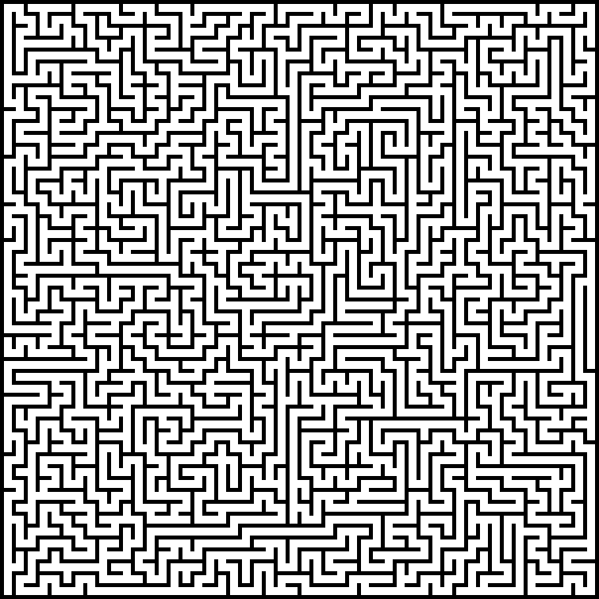
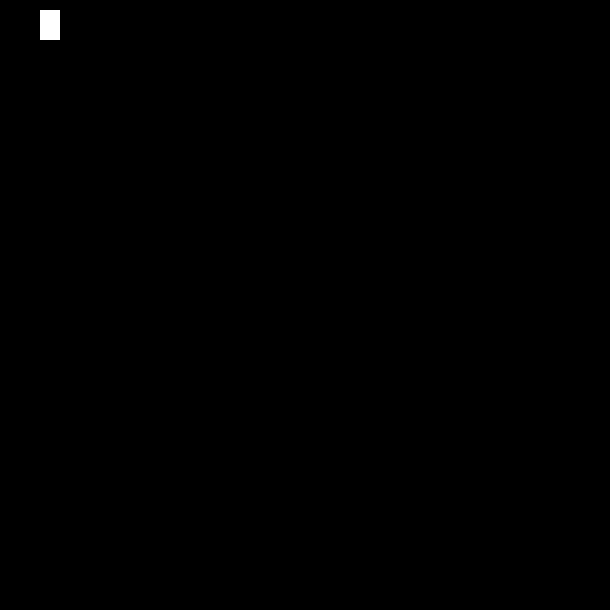
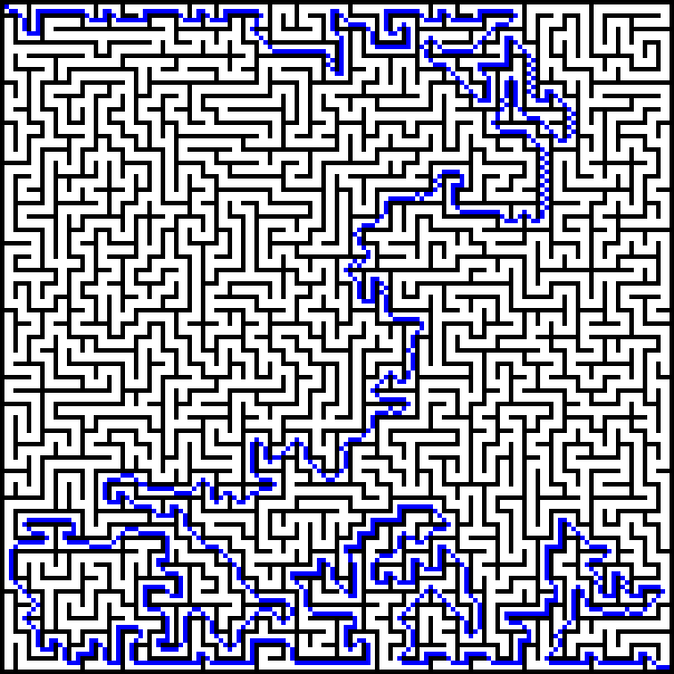
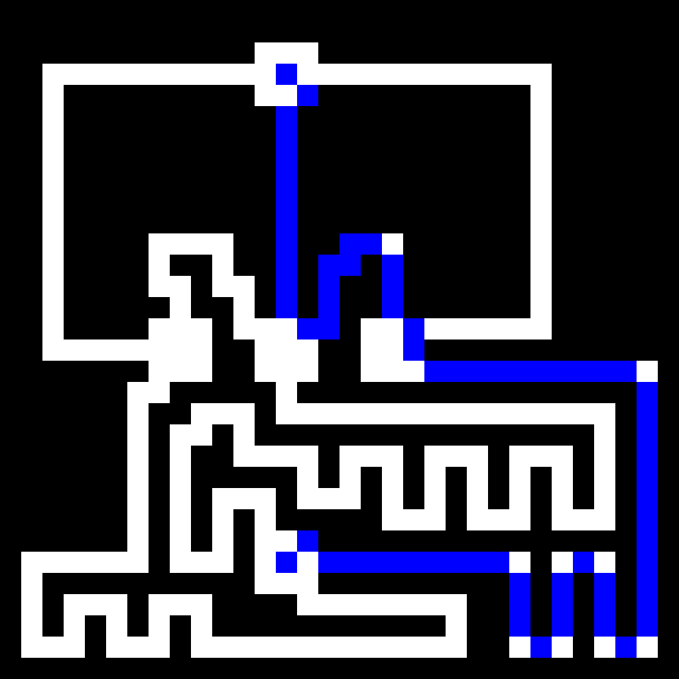
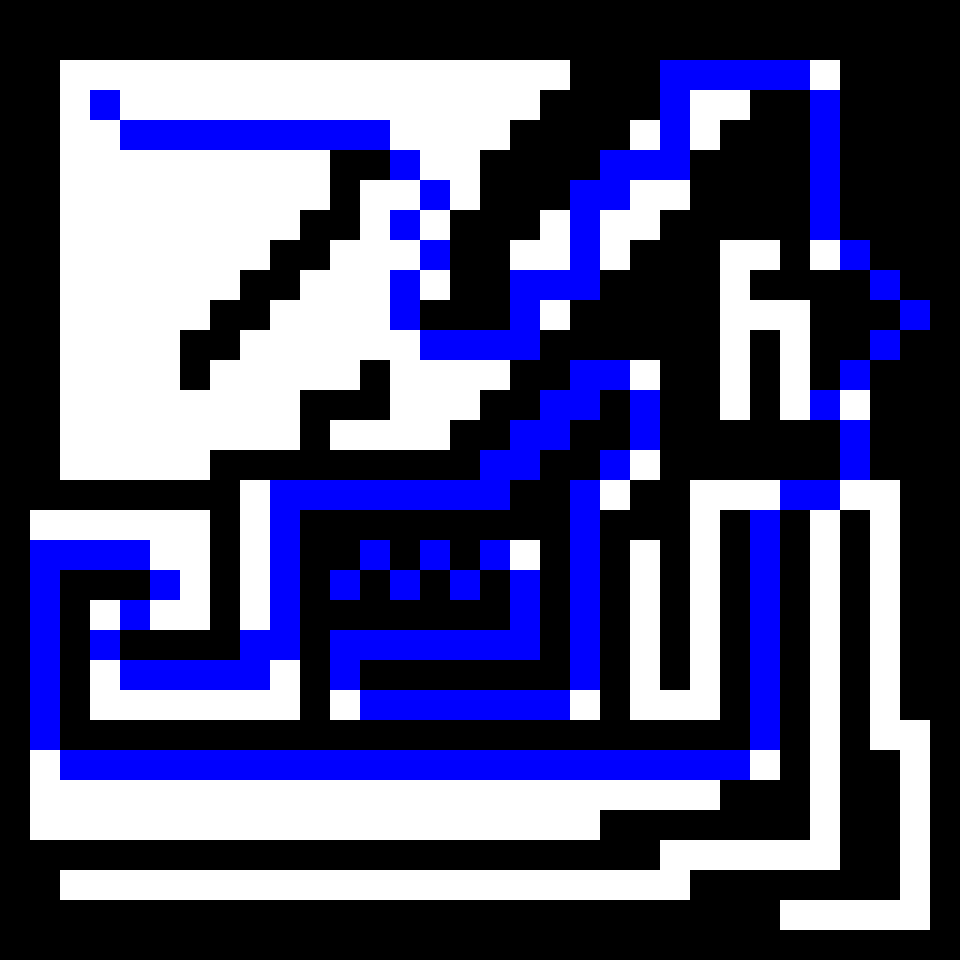

# Maze Generator
Maze generator built in R.
The maze is generated by a [random walk](https://en.wikipedia.org/wiki/Random_walk).
The maze is solved by a path search algorithm called [A* (A-Star)](https://en.wikipedia.org/wiki/A*_search_algorithm).


## Maze Generation :

To generate a maze, simply run the functions in __mazer.R__. 
__labyrinth()__ generates a complete maze. 
__labyrinth_2()__ generates an object to vizualize the animation of the process of maze making. 


```R
# Generate Maze ----------------------------------------------------------------------------------------------
board <- matrix(0, 50, 50) # 50x50 Board
board_cells <- labyrinth(10, 10, board = board) # Rat starting position at (10,10)
board_cells <- esticar(board_cells, 5)
imagem <- board_cells %>% as.cimg()
imagem %>% plot()

# Saving the maze

f <- tempfile(fileext = ".png", tmpdir = getwd())
save.image(imagem, f, 1)

```


```R
# Generate Maze ----------------------------------------------------------------------------------------------
board <- matrix(0, 50, 50) # 50x50 Board
board_cells <- labyrinth(10, 10, board = board) # Rat starting position at (10,10)
board_cells <- esticar(board_cells, 5)
imagem <- board_cells %>% as.cimg()
imagem %>% plot()

# Saving the maze

f <- tempfile(fileext = ".png", tmpdir = getwd())
save.image(imagem, f, 1)

```

### Animation :


```R
# Animation ---------------------------------------------------------------------------------------------------
# SETUP

board <- matrix(0, 20, 20) # 20x20 Board
board_frames <- labyrinth_2(1,1, board = board) #  Rat starting position (1,1)
animation <- lapply(board_frames, esticar, 5)
animation <- array(data = unlist(animation), dim = c(dim(animation[[1]]), length(animation), 1)) %>% as.cimg()
animation %>% play(loop = T, delay = 30) 

# Saving the animation

f <- tempfile(fileext=".mp4",tmpdir = "WHERE TO SAVE" )
save.video(animation,f, fps = 30)

```




## Maze Solving :

To solve a maze generated by __labyrinth()__ , run the functions in __astar.R__ and pass the maze to __aStar()__ which will generate the shortest path between __inicio__ and __destino__. The algorithm solves a path in a grid like board, where "1" (numeric) stands for a walkable path.

```R
#---- Maze Solvin ---------------------------------
# Generating a maze
board <- matrix(0,20,20)
board <- labyrinth(start_coord_x = 1,start_coord_y = 1,board = board)
board <- board[[1]]
board[board == 0] <- 2
board[board == 1] <- 0
board[board == 2] <- 1
plot(as.cimg(t(board)))

# Solving the Maze
caminho <- aStar(inicio = c(2,2),destino = c(60,60), board = board) # inicio = Initial point in the maze . destino = Final point in the maze.

board[Pair(caminho$x,caminho$y)] <- "S"
board[board == 0] <- "W"
board[board == 1] <- "P"
board <- t(board)
board <- esticar(board,5)

imRgb <- mk_rgb_array(board)


imRgb <- array(data = unlist(imRgb), dim = c( dim(board) ,1,3))
imRgb <- as.cimg(imRgb)
imRgb %>% plot() 

# Saving the solution
f <- tempfile(fileext=".png",tmpdir = "C:/Users/Matheus/Desktop/imagens" )
save.image(d,f)

```


## General path finding.

A-star can be used to find general paths between two points as long the board have bound walls and not so long diagonal paths (Can be corrected).
You can draw your your board with any drawing tool . https://www.pixilart.com/draw

```R
#------------ General Path ------------

im <- load.image("11.png")
plot(im)
imagems <- matrix(as.array(im)[,,1,1], nrow = 32 , ncol = 32)
imagems <- round(imagems)
imagems <- t(imagems)
caminho <- aStar(board = imagems ,inicio = c(4,4) , destino = c(20,12))
#imagems[imagems == 0] <- "###"

imagems[Pair(caminho$x,caminho$y)] <- "S"
imagems[imagems == 0] <- "W"
imagems[imagems == 1] <- "P"
imagems <- t(imagems)
imagems <- esticar(imagems,30)

imRgb <- mk_rgb_array(imagems)


imRgb <- array(data = unlist(imRgb), dim = c( dim(imagems) ,1,3))
imRgb <- as.cimg(imRgb)
imRgb %>% plot() 

f <- tempfile(fileext=".png",tmpdir = "" )
save.image(imRgb,f)

```



